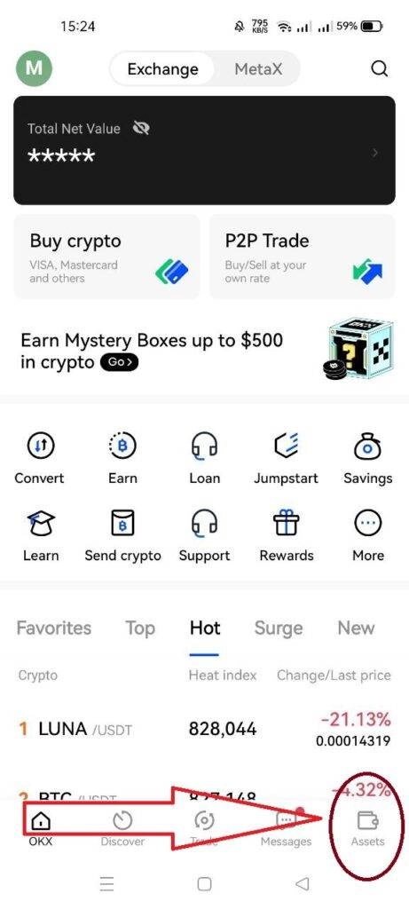
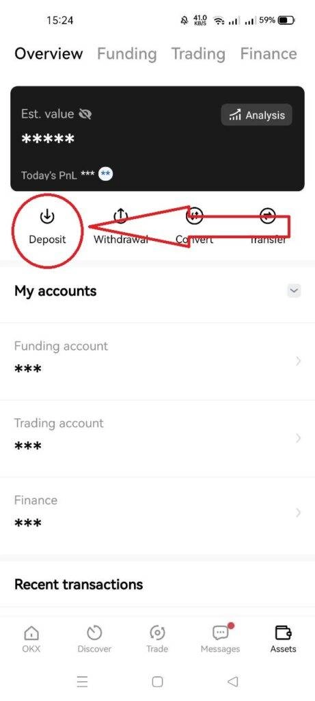
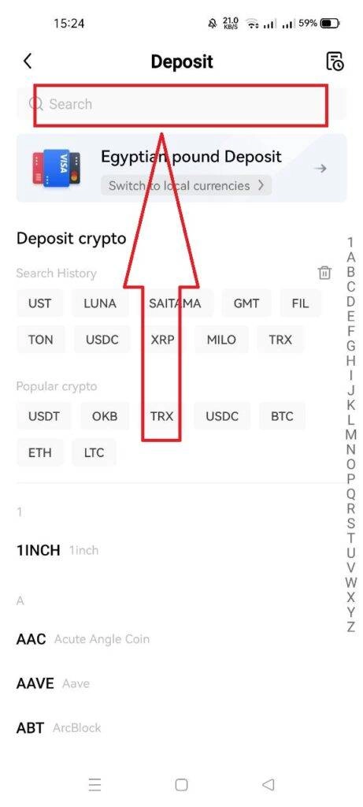
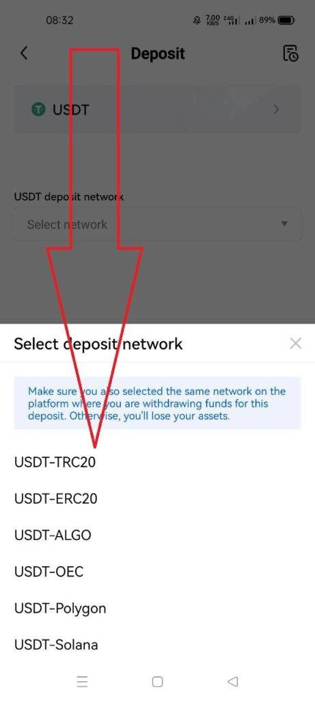
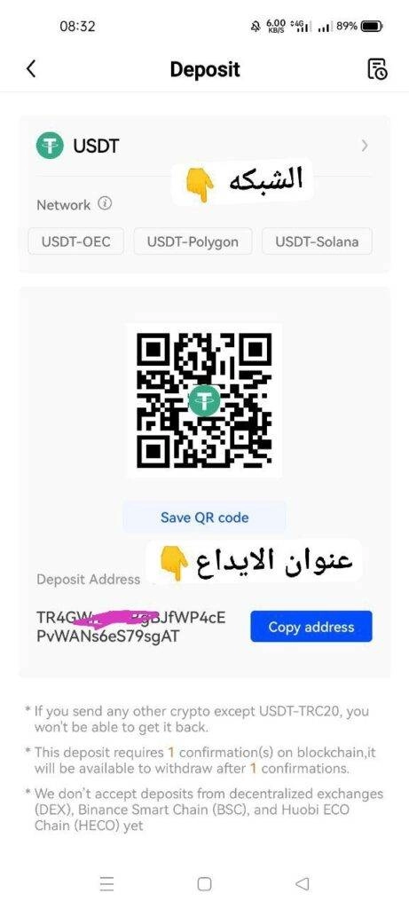
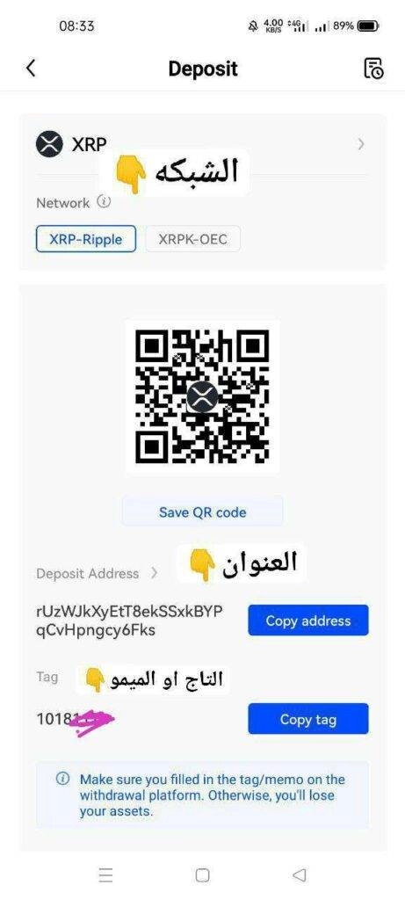

# OKX 平台存币操作全流程详解

---

在加密货币交易中,存币（Deposit）是最基础却也最容易出错的操作。特别是OKX平台在2022年更新后,不少用户反映找不到入口、不知道怎么选网络,甚至因为忘记填Memo导致资金卡在半路。

这篇文章会用最直白的方式,带你搞懂OKX存币的全部细节——从基础概念到实操步骤,包括那些容易踩坑的地方。看完你就能轻松完成存币,不再为"钱去哪了"而焦虑。

---

## 什么是存币(Deposit)?

说白了,存币就是把你在其他平台或钱包里的加密货币,转到你的OKX账户里。

整个过程需要一个"地址"——就像银行转账需要账号一样。你从OKX获取这个地址,然后在发送方平台填入这个地址,币就会自动转过来。

听起来简单,但实际操作时有不少细节需要注意。

---

## OKX存币操作步骤(2022最新版本)

### 第一步:进入资产页面

登录[OKX平台](https://www.okx.com/join/62834398)后,点击底部导航栏最右边的"Assets"(资产)按钮。

### 第二步:找到存币入口

在资产页面,点击"Deposit"按钮。

### 第三步:选择要存入的币种

在搜索框输入你想存入的币种名称,比如USDT、BTC等。

### 第四步:选择网络类型

这一步很关键!同一种币可能支持多条链(比如USDT支持ERC20、TRC20、BSC等)。

**你必须选择和发送方相同的网络,否则币会丢失。**

### 第五步:复制存币地址

选好网络后,点击"Copy Address"复制地址,然后到发送方平台粘贴这个地址完成转账。

---

## 存币时必须知道的4个细节

### 1. 最低存币额度

每个币种都有最低存币限制,低于这个数量的存币**不会到账**。

存币页面地址下方会显示最低额度,转币前务必确认你的金额达标。

### 2. 矿池存币限制

OKX在某些网络(如以太坊)上不接受直接从矿池存币。如果页面出现相关提示,千万别从挖矿网站直接转币过来。

### 3. 到账需要时间

加密货币转账需要区块链确认,不同币种确认时间不同。别着急,耐心等待就行。

### 4. 暂停存币提示

如果看到"Deposit is currently suspended"(存币暂停),说明这个币种的存币功能临时关闭,过段时间再试。

---

## 如何查看存币是否到账?

在存币页面点击右上角的历史记录图标,可以看到所有存币记录。

**状态说明:**
- **Complete**(完成):币已到账
- **Pending**(处理中):还在等待区块链确认

---

## 特殊情况:需要Memo/Tag的币种

有些币种(如XRP、XLM)存币时不光需要地址,还需要额外填写**Memo**或**Tag**。

### 什么是Memo?

简单理解:OKX给这类币种设置了一个公共地址,但每个用户有独立的Memo编码。转币时必须同时填写地址和Memo,系统才能识别出是转给你的。

👉 [立即注册OKX开始安全存币](https://www.okx.com/join/62834398)

### Memo存币操作流程

步骤和普通存币一样,只是在最后一步,除了复制地址,还要复制下方的Memo/Tag编码,并在发送方平台的"Memo"或"Tag"栏填入。

**以XRP(瑞波币)为例:**

### 忘记填Memo怎么办?

如果转币时忘记填Memo,币**不会自动到账**。这时候需要联系OKX客服,提供交易哈希(TXID)请求人工处理。

---

## 总结

OKX的存币功能其实不复杂,核心就是"选对币种、选对网络、复制准地址"。对于需要Memo的币种,多留个心眼就行。

现在你应该明白了:为什么有人说"转币5分钟,排查问题5小时"——细节决定成败。但只要按照这篇文章的步骤来,你完全可以避免那些常见的坑。

想开始使用OKX进行存币交易?[点击这里注册账号](https://www.okx.com/join/62834398)(邀请码:62834398),新用户还有机会获得高达500美元的注册奖励。
